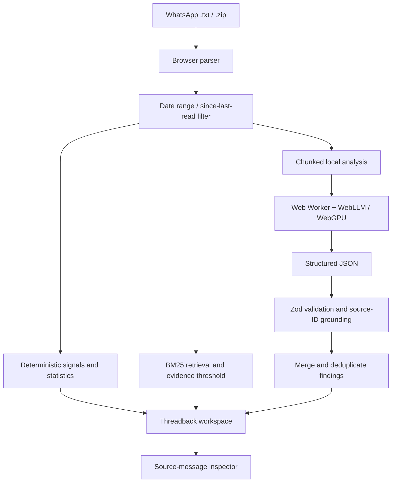

# THREADBACK

**Catch up on what matters. Not every message.**

Threadback turns a WhatsApp chat export into a prioritized catch-up briefing: messages that may need your attention, deadlines, changed decisions, action items, open questions, topic summaries, and evidence-linked answers to questions about the conversation.

Built for the hackathon challenge **“The Unread Problem — What Did I Miss?”**

> **Privacy principle:** conversation analysis is designed to run in the browser. There is no database, account system, or application API route that should receive chat contents. The local model and its runtime assets may be downloaded from configured static hosts. Verify this in DevTools before making deployment-level privacy claims.

## Product experience

1. **Import** a WhatsApp `.txt` export or `.zip` containing a `.txt` export.
2. **Choose the range**: a custom date range, a last-read message, or a timestamp.
3. **Identify yourself** so Threadback can prioritize relevant mentions, requests, and deadlines.
4. **Review the briefing**: deterministic signals are available without AI; a compatible local model can add contextual analysis.
5. **Verify the evidence** by opening source-message citations, with sender, timestamp, and surrounding context.

### Workspace sections

- **Briefing** — needs your attention, dates, selected-range statistics, summary and highlights.
- **Your priorities** — explainable rule-based signals for mentions, questions, requests and likely deadlines.
- **Decisions & changes** — earlier plan versus latest supported plan, with uncertainty flags and source links.
- **Deadlines & events** — deterministic date phrases plus model-extracted deadlines.
- **Action items** — tasks, explicit/inferred labeling, evidence for owners and deadlines, and session-only done states.
- **Open questions and topics** — findings linked to their source messages.
- **Message triage** — reply needed, deadline soon, and FYI; suggested replies are drafts only and are never sent.
- **Ask your chat** — retrieval-first question answering with source validation and refusal when evidence is insufficient.
- **Ask this moment** — ask using a selected message and nearby context.
- **Chat stats** — deterministic counts and participant activity.
- **Privacy & data** — current fetch-monitor observations, model-host requests, cache status and WebGPU capability.

## Architecture



### Data handling

- Original message text is preserved by the parser and displayed unchanged in the source inspector.
- The file, parsed messages, analysis results and questions are kept in application session state.
- Date filtering, counts, basic signals and retrieval operate in browser code.
- Local AI uses a Web Worker. Model weights/runtime files are fetched from the hosts configured in `src/config/model.ts` and `next.config.mjs`.
- There are no database calls or application server routes intended to receive chats.
- The app wraps `fetch` in the page and model worker to record request metadata (host, method, body size), not content. This is a useful signal, **not a complete browser-network audit**; inspect the browser Network panel as well.
- Google Fonts are currently referenced by the page layout and may be downloaded separately. No chat content should be sent with font requests.
- “Clear all data” clears the current application session; the browser's own model cache may remain.

## Quick start

Requirements: Node.js compatible with the selected Next.js release, npm, and a modern browser. For local AI, use desktop Chrome or Edge with working WebGPU and sufficient GPU memory.

```bash
npm install
npm test
npm run typecheck
npm run dev
```

Then open [http://localhost:3000](http://localhost:3000). The workspace lives at `/app`.

Useful routes:

- `/` — Threadback landing page.
- `/app` — import a chat.
- `/app?demo=1` — synthetic sample conversation.
- `/app?feature=briefing` — sample workspace focused on the briefing.
- `/app?feature=priorities` — sample workspace focused on priorities.
- `/app?feature=decisions` — sample workspace focused on decisions.
- `/app?feature=ask` — sample workspace focused on Ask your chat.
- `/app?feature=triage` — sample workspace focused on triage.

Create a production build with:

```bash
npm run build
npm start
```

## Local model configuration

The model configuration is centralized in `src/config/model.ts`.

| Setting | Current value / status |
|---|---|
| WebLLM dependency | `@mlc-ai/web-llm` `^0.2.85` |
| Model ID | `Qwen2.5-1.5B-Instruct-q4f16_1-MLC` |
| Configured weights host | `huggingface.co` (download only; no hosted inference) |
| Compiled runtime host | `raw.githubusercontent.com` |
| Approximate download | `1000 MB` estimate in code; **not measured in a real browser yet** |
| Configured VRAM | `1629.75 MB` from WebLLM's prebuilt configuration |
| Model license | **Not yet verified in this project; check the exact model card and distribution terms before public use.** |
| Browser inference | Written in code, but must be verified on a real WebGPU device |

Do not commit model weights or bundle them into Vercel. WebLLM may contact redirect/CDN hosts not visible from the initial model URL. The CSP allowlist and privacy monitor require confirmation against actual Network-panel hostnames; guessed hosts must not be described as verified.

## Tests and verification status

The repository includes tests for:

- WhatsApp parser variants, multiline messages, system/media messages, date ambiguity and `.zip` input;
- range filtering, statistics, mention/deadline detection and triage;
- BM25 retrieval, evidence thresholds, unrelated-question refusal and source-ID validation;
- chunked pipeline, JSON repair, grounding, merging, Q&A and suggested replies (with a scripted LLM test double);
- fetch-monitor accounting.

**Important status note:** the original engine author reported **69 tests passing across five files** before this UI integration. The final integrated snapshot has not been fully re-run in this environment because dependency installation timed out. A TypeScript syntax/transpile pass inspected 26 `.ts`/`.tsx` files and reported zero syntax errors; this is not a substitute for `npm test`, `npm run typecheck`, or `npm run build`.

Real browser model loading, WebGPU inference, model output quality, exact download size, and the final deployed network behavior remain **unverified until checked in Chrome/Edge**. See [`docs/VERIFY_IN_CHROME.md`](docs/VERIFY_IN_CHROME.md) and [`docs/IMPLEMENTATION_STATUS.md`](docs/IMPLEMENTATION_STATUS.md).

## Development notes

- Main UI: `src/components/landing.tsx`, `src/components/threadback-app.tsx`.
- Original Claude Design reference: [`reference/threadback.html`](reference/threadback.html).
- Parsing/filtering/signals: `src/lib/parser.ts`, `src/lib/filter.ts`, `src/lib/detect.ts`.
- Retrieval and AI analysis: `src/lib/retrieval.ts`, `src/lib/pipeline.ts`, `src/lib/schema.ts`, `src/lib/prompt.ts`.
- Local model and worker: `src/lib/engine.ts`, `src/workers/llm.worker.ts`.
- Synthetic demo chat: `src/data/sample.ts`.
- Original engineering prompt: [`prompts/01-claude-build-brief.md`](prompts/01-claude-build-brief.md).
- Prompt index: [`PROMPT.md`](PROMPT.md).

## Privacy and limits

Threadback can surface useful signals, but language models may still miss a task, misunderstand context, or misinterpret relative dates and multilingual slang. Verify consequential findings against cited messages. WhatsApp export timestamps are timezone-naive in the current parser, and “kal” or similar relative phrases can be ambiguous. Local model availability and quality depend on browser, GPU, memory, model compatibility and download success.

Threadback is an independent hackathon project and is not affiliated with WhatsApp or Meta.
