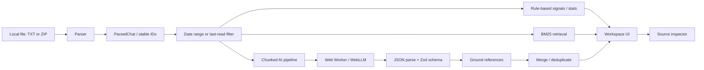

# Architecture

Threadback is a static-first Next.js app. Parsing, filtering, rule-based signal detection, retrieval, local inference and generated output are client-side features; there is no application database or API route designed to receive chat content.

## Core modules

- `src/lib/parser.ts`: parses WhatsApp export headers, multiline bodies, system lines and media placeholders; reads `.txt` and ZIP exports.
- `src/lib/filter.ts`: filters a parsed chat by range or last-read point and computes summary stats.
- `src/lib/detect.ts`: deterministic mention, question, deadline and triage signals with reasons.
- `src/lib/retrieval.ts`: keyword/BM25 retrieval and evidence threshold before Q&A.
- `src/lib/chunk.ts`: breaks long chats into model-sized chunks with context overlap.
- `src/lib/prompt.ts`: model instructions, schema hints, quoted data boundaries and injection-marker handling.
- `src/lib/pipeline.ts`: chunk analysis, Q&A and suggested replies through a pluggable `LLM` interface.
- `src/lib/schema.ts`: JSON extraction, Zod schema validation and source ID grounding.
- `src/lib/merge.ts`: combines grounded findings and removes duplicates.
- `src/lib/engine.ts` + `src/workers/llm.worker.ts`: browser local-model worker.
- `src/lib/network-monitor.ts`: monitors `fetch` metadata in page/worker scopes. It is not a comprehensive browser traffic capture.
- `src/components/threadback-app.tsx`: import stages, analysis status, workspace and source inspector.
- `src/components/landing.tsx`: landing page and scroll-linked storytelling.

## Source grounding

Analysis prompts assign temporary numeric references to messages in the current chunk. The pipeline maps those numbers back to stable IDs, validates that those IDs exist in the parsed chat and drops findings without valid sources. Owners, deadlines and completion statuses receive additional checks against cited messages. Q&A retrieves messages first, refuses when relevance is insufficient, and requires valid cited message IDs before an answer is displayed as answered.

## State lifetime

Current imported messages and results live in React session state. Clear All Data resets this state. The browser's cache for downloaded model assets may persist, as required for reload/cached use. The app does not intentionally persist conversations or findings in `localStorage` or IndexedDB.

## Important limits

- WebGPU and WebLLM behavior must be checked on actual supported browsers/devices.
- The model ID is present in the configured WebLLM package list according to the original implementation report, but model-license terms, exact CDN redirect hosts and actual total download size still need verification.
- The fetch monitor observes calls made through patched `fetch`; it does not inspect every possible network mechanism. Use DevTools Network during privacy validation.
